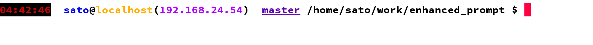

# EnhancedPrompt

## Features

- Extremely flexible running as ruby internal DSL
- Helpful information including IP, git branch, nicely abbreviated path name
- Can change colors in simple syntax (thanks to Rainbow) 

## Installation

Currently, this gem is not registered to ruby-gem.org.  
See Development to install this gem.  
After that, set enhanced-prompt as your PROMPT_COMMAND.

```bash
cat << EOF > ~/.bashrc
export PROMPT_COMMAND='enhanced-prompt'
export PS1=''
EOF
```

## Customize

By default, you will see enhanced-prompt default style.  
You can configure this with ~/.enhanced-prompt file.  

For instance, if you create the following ~/.enhanced-prompt file.  

```ruby 
time1.c(:red).bg(:black) + '  ' + user.c(:blue) + '@' + host.c(:orange) +                                                                                                                     
'(' + ip.c(:purple) + ')' + '  ' + git.c(:indigo)._  + ' ' + dir + ' $ '
```

You will see something like this. 



### Tokens

Run ```enhanced-prompt --tokens``` to check available tokens

### Color / Style

You can change foreground/background color or toggle underbar with the following methods

- c(color)
- bg(color)
- _

You can check available colors with ```enhanced-prompt --colors```

## Development

After checking out the repo, run `bin/setup` to install dependencies. Then, run `rake rspec` to run the tests. You can also run `bin/console` for an interactive prompt that will allow you to experiment.

To install this gem onto your local machine, run `bundle exec rake install`. To release a new version, update the version number in `version.rb`, and then run `bundle exec rake release`, which will create a git tag for the version, push git commits and tags, and push the `.gem` file to [rubygems.org](https://rubygems.org).

## Contributing

Bug reports and pull requests are welcome on GitHub at https://github.com/[USERNAME]/enhanced_shell_ps1. This project is intended to be a safe, welcoming space for collaboration, and contributors are expected to adhere to the [Contributor Covenant](contributor-covenant.org) code of conduct.


## License

The gem is available as open source under the terms of the [MIT License](http://opensource.org/licenses/MIT).

